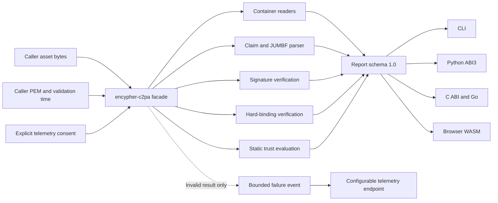

# Architecture

One Rust verification core serves every language binding.

## Public facade

`crates/encypher-c2pa` owns the stable API and report mapping. Consumers should depend on this crate, not support crates under `internal/`.

The support crates are separately packaged only because crates.io requires every dependency in a published package graph to exist in the registry. Their APIs are implementation details and may change in any alpha release.

## Verification core

- `internal/c2pa-cbor`: exact CBOR profiles used by C2PA claims and assertions.
- `internal/c2pa-core`: JUMBF, claims, assertions, spec versions, and engine profiles.
- `internal/c2pa-formats`: format detection, manifest extraction, and hard-binding byte ranges.
- `internal/c2pa-crypto`: COSE signature algorithms and certificate extraction.
- `internal/c2pa-trust`: caller-supplied certificate-chain evaluation.
- `internal/c2pa-validate`: manifest-store traversal and validation status production.

No support crate contains a network client. The public facade's default `telemetry` feature provides the opt-in native transport; WASM disables that feature and uses the browser transport only after explicit consent.

## Bindings

- `crates/encypher-c2pa-cli`: file-oriented CLI with JSON and human output; `--telemetry` opts in.
- `bindings/python`: PyO3 adapter. CPU work releases the Python GIL; `telemetry=True` opts in.
- `bindings/c`: panic-contained C ABI returning an owned JSON envelope. `VerifyOptions` JSON carries telemetry consent.
- `bindings/go`: typed cgo wrapper over the C ABI.
- `bindings/wasm`: wasm-bindgen adapter returning a native JavaScript object and posting consented failures with browser `fetch`.

All bindings delegate semantics to the Rust facade. They do not reinterpret validation statuses.

## Resource boundaries

The public v1 API accepts an in-memory byte slice. File helpers read the file before verification. Browser verification also copies the selected `ArrayBuffer` into WASM memory. These choices keep the first public API small and deterministic, but they make memory use proportional to asset size.

Do not use the browser binding for multi-gigabyte compositions. A future streaming API must preserve each format's exclusion and offset invariants before it can replace the byte-slice contract.

The core caps pathological data-hash exclusion lists before parsing or hashing their ranges. Parsers use checked arithmetic and reject truncated or malformed structures.

## Release graph

Rust support crates publish first, then the public facade and CLI. Python wheels, npm WASM packages, Go/C archives, and CLI binaries are built from the same tag. CI verifies that every binding reports the same `schema_version` and `profile` for the shared fixtures.
